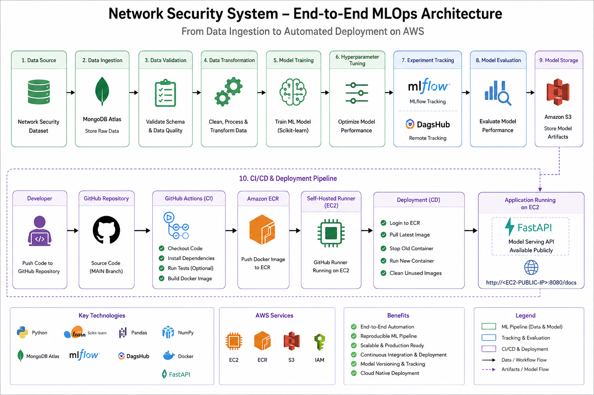
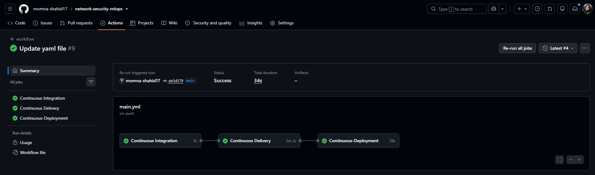
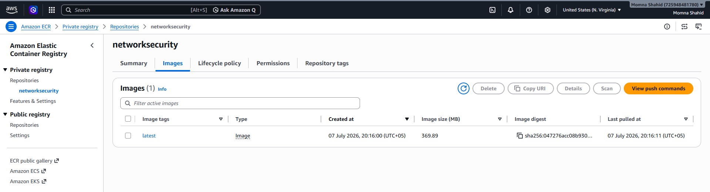
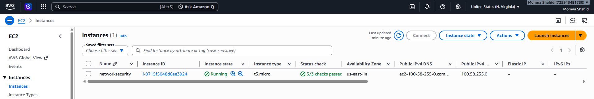
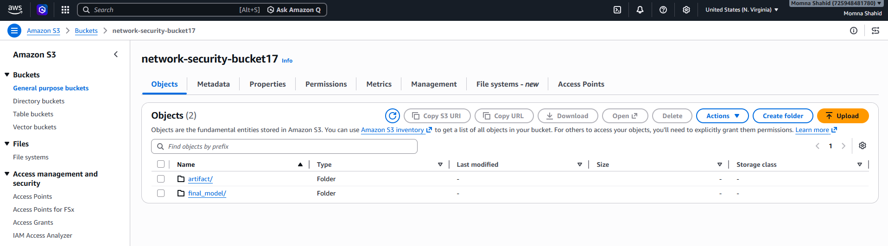
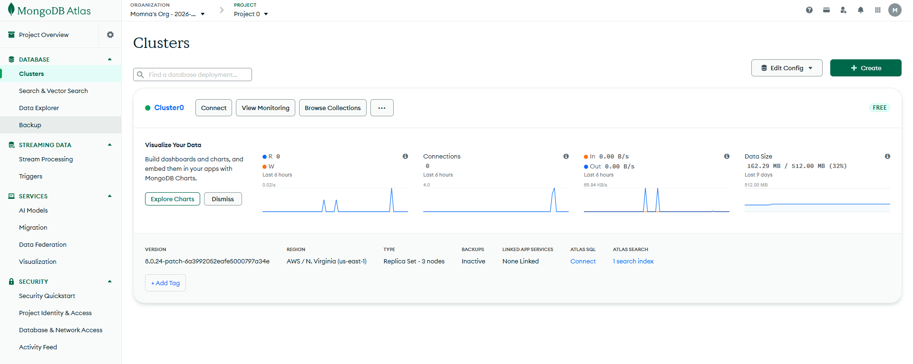

# 🛡️ Network Security System using End-to-End MLOps

<div align="center">


### End-to-End MLOps Pipeline for Network Security Threat Detection

Production-ready MLOps project with automated CI/CD using **GitHub Actions → Docker → Amazon ECR → Self-Hosted GitHub Runner → AWS EC2**.

</div>

---

# 📌 Repository

**GitHub:** https://github.com/momna-shahid17/network-security-mlops

---

# 📖 Overview

This project demonstrates a complete production-ready Machine Learning Operations (MLOps) workflow for Network Security Threat Detection.

The project automates:

- Data Ingestion
- Data Validation
- Data Transformation
- Model Training
- Hyperparameter Tuning
- MLflow Experiment Tracking
- DagsHub Integration
- Model Evaluation
- AWS S3 Artifact Storage
- Docker Containerization
- GitHub Actions CI/CD
- Amazon ECR
- AWS EC2 Deployment using Self-Hosted Runner
- FastAPI Model Serving

---

# 🚀 Features

- End-to-End MLOps Pipeline
- ETL Pipeline
- MongoDB Atlas
- MLflow
- DagsHub
- Docker
- GitHub Actions
- Amazon ECR
- Amazon EC2
- Amazon S3
- FastAPI
- Automated Deployment

---

# 🏗️ Architecture

Add your generated architecture diagram here.

```markdown

```

---

# 📂 Repository Structure

```text
network-security-mlops/
│
├── assets/
│   └── images/
├── .github/
│   └── workflows/
├── Network_data/
├── data_schema/
├── networksecurity/
├── templates/
├── Dockerfile
├── app.py
├── main.py
├── requirements.txt
├── setup.py
└── README.md
```

---

# 🛠 Tech Stack

- Python
- Scikit-learn
- Pandas
- NumPy
- MongoDB Atlas
- MLflow
- DagsHub
- FastAPI
- Docker
- GitHub Actions
- Amazon EC2
- Amazon ECR
- Amazon S3

---

# ⚙️ Installation

```bash
git clone https://github.com/momna-shahid17/network-security-mlops.git

cd network-security-mlops

python -m venv venv

# Windows
venv\Scripts\activate

# Linux/macOS
source venv/bin/activate

pip install -r requirements.txt
```

---

# 🔐 Environment Variables

Create a `.env` file.

```env
MONGODB_URL=<your-mongodb-url>

AWS_ACCESS_KEY_ID=<your-access-key>

AWS_SECRET_ACCESS_KEY=<your-secret-key>

AWS_REGION=<your-region>

AWS_BUCKET_NAME=<your-bucket>
```

---

# 🔑 GitHub Secrets

Configure these repository secrets:

- AWS_ACCESS_KEY_ID
- AWS_SECRET_ACCESS_KEY
- AWS_REGION
- AWS_ECR_LOGIN_URI
- ECR_REPOSITORY_NAME

---

# ☁️ EC2 Setup

```bash
sudo apt update -y
sudo apt upgrade -y

curl -fsSL https://get.docker.com -o get-docker.sh

sudo sh get-docker.sh

sudo usermod -aG docker ubuntu

newgrp docker

docker --version

docker ps
```

---

# 📊 MLflow

```bash
mlflow ui
```

Open:

```
http://127.0.0.1:5000
```

---

# 🚀 Run Locally

```bash
python main.py
```

```bash
python app.py
```

---

# 🐳 Automated Docker Deployment

The Docker image is **automatically** built and deployed.

Workflow:

1. Push code to `main`
2. GitHub Actions starts
3. Docker image is built
4. Docker image is pushed to Amazon ECR
5. Self-hosted GitHub Runner running on EC2 pulls the latest image
6. New container is deployed automatically

**No manual Docker build or push commands are required for deployment.**

---

# 🔄 CI/CD Pipeline

### Continuous Integration

- Checkout Source Code
- Basic Validation
- Configure AWS Credentials
- Build Docker Image
- Push Docker Image to Amazon ECR

### Continuous Deployment

- Login to Amazon ECR
- Pull Latest Image
- Deploy Updated Container
- Clean Unused Docker Images

Deployment is automatically triggered on every push to the **main** branch.

---

# 📸 Project Screenshots

```markdown













```

---

# ☁️ AWS Services

- Amazon EC2
- Amazon ECR
- Amazon S3
- IAM

---

<<<<<<< HEAD
# 📈 Experiment Tracking

### MLflow

- Experiment Tracking
- Parameters Logging
- Metrics Logging
- Artifact Management

### DagsHub

- Remote Experiment Tracking
- Model Versioning
- Artifact Storage

---

=======
>>>>>>> c2f1cb8 (Update README.md & Add Images)
# 🔮 Future Improvements

- Kubernetes
- Helm
- ArgoCD
- Prometheus
- Grafana
- Kafka
- Feature Store
- Model Drift Detection

---

# 👩‍💻 Author

**Momna Shahid**

DevOps • Cloud • Kubernetes • MLOps Engineer

GitHub:
https://github.com/momna-shahid17

LinkedIn:
https://www.linkedin.com/in/momna-shahid/

---

# ⭐ Support

If you found this project useful, consider giving it a ⭐ on GitHub.
